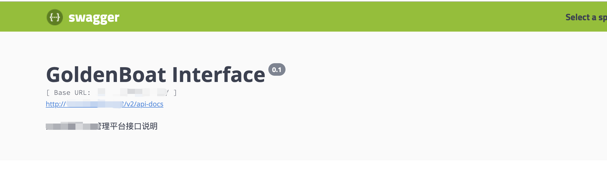
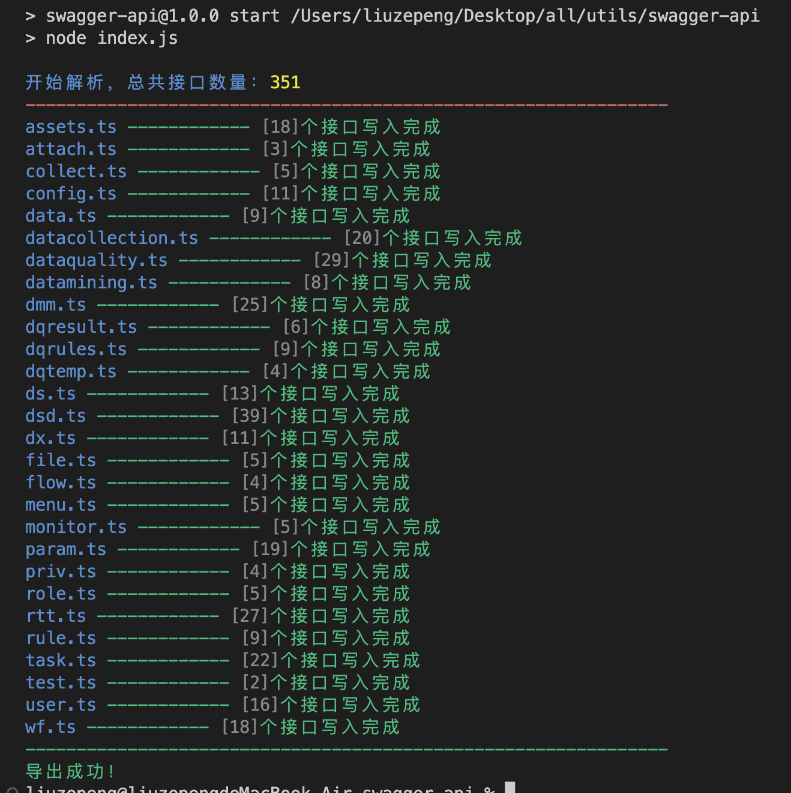
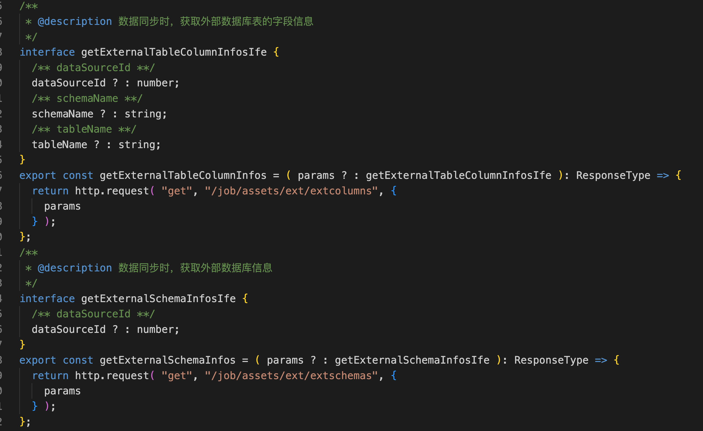

**根据后端生成的swagger文档，导出生成前端需要的api.ts文件，提高开发效率。**

**核心代码：**  src/utils/index.js

**配置文件：**  src/utils/config.js 

**生成目录：**  src/api



**swagger内容项**

```javascript
// swagger文档
// info：API的基本信息，包括标题、版本号、描述等。
// host：API的主机名和端口号。
// basePath：API的基本路径，通常是API的前缀。
// schemes：API的协议，通常是http或https。
// tags：API的标签，可以用于对API进行分类。
// paths：API的路径和操作，包括HTTP方法、请求参数、响应内容等。
	// operationId: 用于指定操作的唯一标识符。
	// summary: 用于提供操作的简要说明。
	// description: 用于提供操作的详细说明。
	// tags: 用于对操作进行分类和组织。
	// parameters: 用于定义在操作中使用的参数，例如查询参数，请求体参数等。
	// requestBody: 用于定义操作的请求体。
	// responses: 用于定义操作的响应，包括响应代码和响应消息。
	// security: 用于指定操作所需的安全方案。
	// deprecated: 用于指定操作是否已被弃用。
// parameters：API的公共参数，可以在多个API中共用。
// responses：API的响应定义，包括响应码、响应内容等。
// securityDefinitions：API的安全定义，包括认证方式、访问授权等。
// security：API的安全配置，指定哪些API需要认证或授权。
```

**安装依赖**

```bash
npm install
```

**运行demo**

```bash
npm run demo
```

**写入配置项后获取**

src/utils/config.js

```javascript
/**
 * 配置项
 * swaggerUrl：swagger文档地址
 * dirIdx：按索引生成文件，比如接口  /job/rule/createOrUpdateDataChangeRules，根据job生成配置1，根据rule生成配置2
 * topConfig：单个ts文件顶部配置，如引入axios，定义返回数据类型等等
 * apiConfig： 单个接口的结构
 */

const swaggerUrl = "http://xxx/v2/api-docs";
const dirIdx = 2
const topConfig = `import http from "../utils/http";
  interface ResponseType extends Promise<any> {
    data?: object;
    code?: number;
    message?: string;
  }`;
const apiConfig = (
  summary, // 接口描述
  interface, // 接口类型定义
  requestName, // 接口名称
  interfaceParams, // 接口传入参数及类型
  requestMethod, // 请求方法 get post delete等
  requestUrl, // 接口地址
  parametersType // 传参类型 data params
) => {
  return `/**
    * @description ${summary}
    */
    ${interface}
    export const ${requestName} = (${interfaceParams}): ResponseType => {
      return http.request("${requestMethod}", "${requestUrl}", {
        ${parametersType}
      });
    };
  `;
  // 生成结构如下
  // /**
  //  * @description 执行作业流
  //  */
  // interface executeFlowIfe {
  //   /** flowName **/
  //   flowName ? : string;
  //   /** projectName **/
  //   projectName ? : string;
  // }
  // export const executeFlow = ( data ? : executeFlowIfe ): ResponseType => {
  //   return http.request( "post", "/job/flow/executeFlow", {
  //     data
  //   } );
  // };
};

module.exports = {
  swaggerUrl,
  dirIdx,
  topConfig,
  apiConfig,
};
```

**命令行**

```bash
npm run dev
或者
npm run start
```

**导出效果：**



**api.ts文件**



**其他说明：**

初次提交，欢迎提出问题，感谢！
